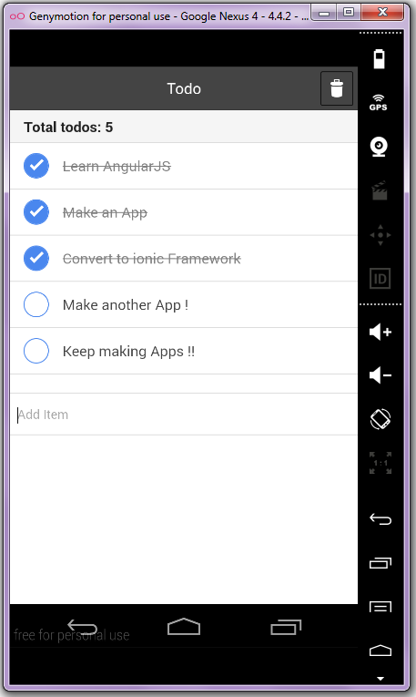

# ToDo
The classic todo app in ionic Angular using node, bower for dependency management and bootstap for UI

Big thanks to [John Lindquist](https://www.youtube.com/watch?v=WuiHuZq_cg4) for the tutorial. The project starts with [AngularJS](http://angularjs.org/) web app.


### Screenshots

The left one is the todo app in phonegap. The right one is using the ionic framework for the same angular app.




### Install Dependencies
```
npm install
```

Behind the scenes this will also call `bower install`.  You should find that you have two new
folders in your project.

* `node_modules` - contains the npm packages for the tools we need
* `bower_components` - contains the angular framework files

## Directory Layout

    app/                --> all of the files to be used in production
      css/              --> css files
        app.css         --> default stylesheet
      img/              --> image files
      index.html        --> app layout file (the main html template file of the app)
      index-async.html  --> just like index.html, but loads js files asynchronously
      js/               --> javascript files
        app.js          --> application
        controllers.js  --> application controllers
        directives.js   --> application directives
        filters.js      --> custom angular filters
        services.js     --> custom angular services
      partials/             --> angular view partials (partial html templates)
        partial1.html
        partial2.html

    test/               --> test config and source files
      protractor-conf.js    --> config file for running e2e tests with Protractor
      e2e/                  --> end-to-end specs
        scenarios.js
      karma.conf.js         --> config file for running unit tests with Karma
      unit/                 --> unit level specs/tests
        controllersSpec.js      --> specs for controllers
        directivessSpec.js      --> specs for directives
        filtersSpec.js          --> specs for filters
        servicesSpec.js         --> specs for services


## Testing
```
npm test
```

[git]: http://git-scm.com/
[bower]: http://bower.io
[npm]: https://www.npmjs.org/
[node]: http://nodejs.org
[protractor]: https://github.com/angular/protractor
[jasmine]: http://pivotal.github.com/jasmine/
[karma]: http://karma-runner.github.io
[travis]: https://travis-ci.org/
[http-server]: https://github.com/nodeapps/http-server
